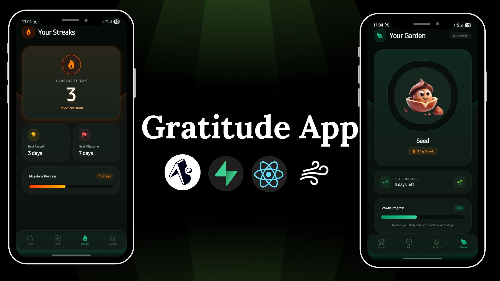

<p align="center">
  
</p>


# 🌱 Gratitude Garden

A beautifully designed gratitude journaling app built with **React Native**, **Expo**, and **AsyncStorage** that helps users build a daily gratitude habit while growing a virtual plant through consistency.

## ✨ Overview

Gratitude Garden transforms daily reflection into a rewarding experience. Every day, users can write one gratitude entry and maintain their streak. As streaks grow, their virtual plant evolves through different growth stages, encouraging mindfulness and consistency.


### 🌿 Growth System

Your plant grows based on your consistency:

| Streak Days | Growth Stage   |
| ----------- | -------------- |
| 0           | Dying Plant    |
| 1 - 6       | Seed           |
| 7 - 29      | Sprout         |
| 30 - 89     | Plant          |
| 90 - 99     | Tree           |
| 100+        | Flowering Tree |

Miss a day and your plant begins to wither, encouraging daily reflection.


## 🛠️ Tech Stack

* React Native
* Expo
* TypeScript
* Expo Router
* AsyncStorage
* Expo Linear Gradient
* Expo Vector Icons

## 📂 Project Structure

```bash
app
├── _layout.tsx
├── index.tsx       # Home
├── add.tsx         # Add Gratitude
├── streaks.tsx     # Streak Tracking
└── garden.tsx      # Plant Growth

utils
├── storage.ts
├── streaks.ts
└── garden.ts
```

## 📱 Features

### 📝 Daily Gratitude Journal

* Add one gratitude entry per day.
* Edit today's gratitude anytime.
* Prevents multiple entries on the same day.
* Clean and distraction-free writing experience.

### 🏡 Home Dashboard

* View today's gratitude.
* Browse previous gratitude entries in a timeline.
* Entries are organized chronologically with dates.

### 🔥 Streak Tracking

* Automatic streak calculation.
* Streak resets when a day is missed.
* Track your best streak record.
* Progress toward upcoming milestones.

## 🚀 Installation

```bash
git clone https://github.com/yourusername/gratitude-garden.git

cd gratitude-garden

npm install

npx expo start
```

## 🎯 Future Improvements

* Cloud backup and sync
* Multiple themes
* Gratitude reminders
* Plant animations
* Export gratitude journal as PDF
* Achievement badges
* Monthly insights and analytics


## 🤝 Contributing

Contributions, ideas, and feedback are always welcome.


---

Built with ❤️ to encourage mindfulness, positivity, and consistency.
